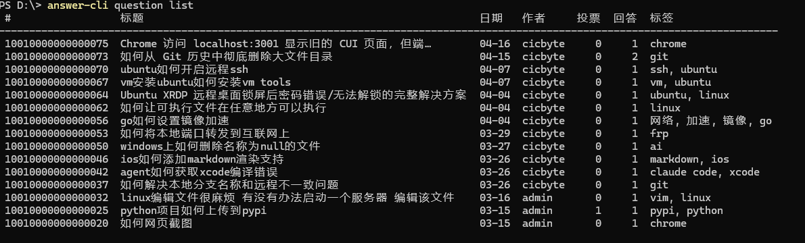
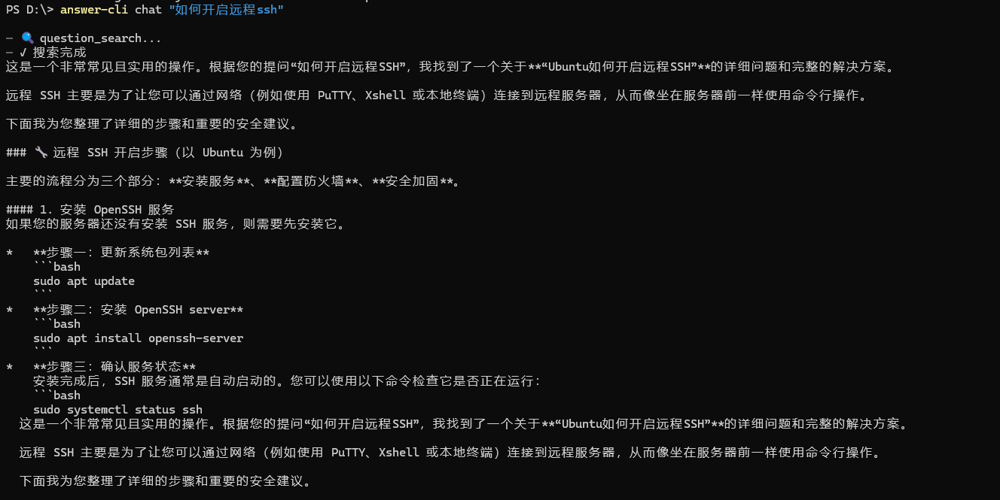
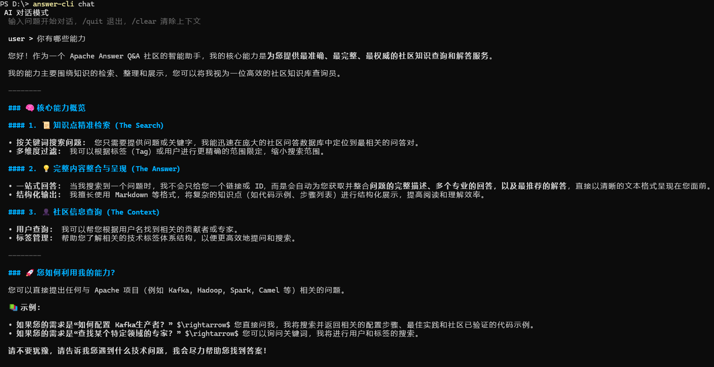
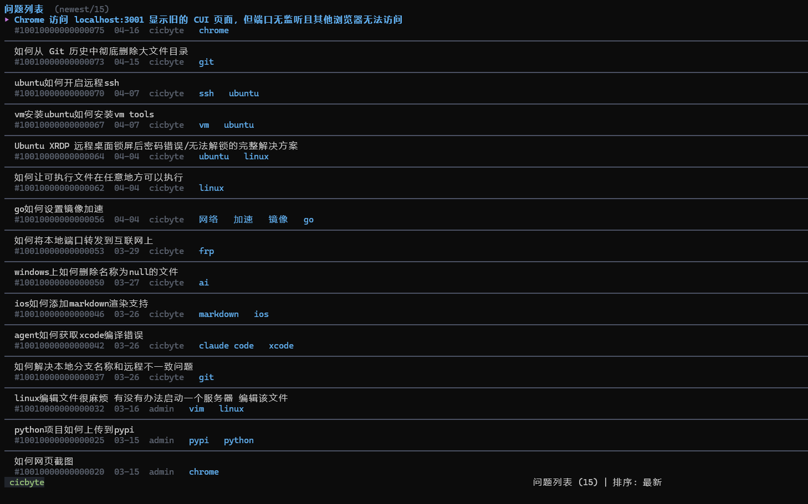

# answer-cli

> Apache Answer Q&A 社区的命令行工具 — TUI 浏览、CLI 操作、AI 对话、MCP 集成，全部在终端完成。

[English](README.en.md) | 简体中文


## 功能特性

- **TUI 浏览模式** — 无参数启动进入 Bubbletea 终端 UI，搜索、浏览问题详情与回答，Markdown 渲染
- **CLI 命令** — 问题、回答、评论、标签、通知的查询与写操作
- **AI 对话** — 基于 API 搜索的 tool calling，LLM 自动检索社区内容并生成回答
- **MCP Server** — stdio 模式，让 Claude Desktop、Cherry Studio 等 AI 客户端直接操作社区数据
- **多格式输出** — pretty / JSON / JSONL，`--format` 全局切换
- **多 AI 提供商** — OpenAI、Ollama、智谱等 OpenAI 兼容 API

## 安装

```bash
git clone https://github.com/cicbyte/answer-cli.git
cd answer-cli
go build -o answer-cli .
```

交叉编译（需 Python 3，可选 UPX）：

```bash
python scripts/build.py --local    # 当前平台
python scripts/build.py             # 全平台（Windows/Linux/macOS）
```

**环境要求：** Go >= 1.24、Apache Answer 实例

## 快速开始

```bash
answer-cli config set server.base_url https://your-answer-site.com
answer-cli auth login
answer-cli                              # TUI 浏览模式
answer-cli search "golang 并发"          # 搜索
answer-cli chat "如何处理 goroutine 泄露？"  # AI 对话
```

## 命令一览

| 命令 | 说明 |
|------|------|
| `auth login` / `logout` / `status` | 认证管理 |
| `config list` / `get` / `set` | 配置管理 |
| `question list` / `get` / `create` / `update` / `delete` / `close` / `reopen` | 问题管理 |
| `answer list` / `get` / `create` / `update` / `delete` | 回答管理 |
| `comment list` / `get` / `add` / `update` / `delete` | 评论管理 |
| `tag list` / `get` / `create` / `update` / `delete` | 标签管理 |
| `notification list` | 通知列表 |
| `search <query>` | 全文搜索 |
| `chat [question]` | AI 对话 |
| `mcp` | 启动 MCP Server |

### 问题



```bash
answer-cli question list                          # 列出问题
answer-cli question list --order hot              # 按热门排序
answer-cli question list --tag go                  # 按标签过滤
answer-cli question get <id>                      # 查看详情（含回答、Markdown 渲染）
answer-cli question create -t "标题" -c "内容" --tags=go
answer-cli question delete <id> --yes
```

### 回答 / 评论 / 标签

```bash
answer-cli answer list <question-id>               # 列出回答
answer-cli answer get <id>                        # 查看回答详情
answer-cli comment list <object-id>               # 列出评论
answer-cli comment add --object-id <id> -c "评论内容"
answer-cli tag list                               # 列出标签
```

### AI 对话

```bash
answer-cli chat "问题"                            # 单轮对话
answer-cli chat -i                                # 多轮交互对话
```





AI Agent 通过 5 个 function tools 检索社区内容（搜索问题、获取详情、列出回答、搜索标签、搜索用户），自动选择检索策略后生成回答。

### 全局选项

```bash
answer-cli question list --format json           # JSON 缩进输出
answer-cli question list --format jsonl          # JSONL 逐行输出
```

## TUI 浏览模式

无参数启动进入 Bubbletea 终端 UI：

```bash
answer-cli
```



| 按键 | 功能 |
|------|------|
| `↑↓` / `j/k` | 移动光标 / 滚动 |
| `Enter` | 进入详情 |
| `/` | 搜索 |
| `Tab` | 切换排序（最新/活跃/热门/评分） |
| `n` / `p` | 翻页 |
| `Home` / `End` | 跳顶部 / 底部 |
| `Esc` | 返回 |
| `q` | 退出 |

## 配置

配置文件：`~/.cicbyte/answer-cli/config/config.yaml`（首次运行自动创建）

```yaml
server:
  base_url: https://your-answer-site.com
  token: your-access-token

ai:
  provider: openai          # openai / ollama / zhipu
  base_url: https://api.openai.com/v1
  api_key: sk-xxx
  model: gpt-4o
```

```bash
answer-cli config set server.base_url https://your-answer-site.com
answer-cli config list
```

## MCP Server

`answer-cli mcp` 以 stdio 模式运行 MCP Server，注册 6 个工具：`question_search`、`question_get`、`answer_list`、`tag_search`、`tag_get`、`user_search`。

**Claude Desktop：**

```json
{
  "mcpServers": {
    "answer": {
      "command": "answer-cli",
      "args": ["mcp"]
    }
  }
}
```

**Cherry Studio：** 设置 → 模型服务 → MCP 服务器 → 添加，命令 `answer-cli`，参数 `mcp`

## 技术栈

- Go 1.24
- [Bubbletea](https://github.com/charmbracelet/bubbletea) + [Bubbles](https://github.com/charmbracelet/bubbles) + [Lipgloss](https://github.com/charmbracelet/lipgloss) + [Glamour](https://github.com/charmbracelet/glamour) — TUI
- [Cobra](https://github.com/spf13/cobra) — CLI 框架
- [mcp-go](https://github.com/mark3labs/mcp-go) — MCP Server
- [go-openai](https://github.com/sashabaranov/go-openai) — OpenAI 兼容 API
- [Resty](https://github.com/go-resty/resty) — HTTP 客户端
- [go-pretty](https://github.com/jedib0t/go-pretty) — 终端表格

## 许可证

[MIT](LICENSE) © 2025 cicbyte
